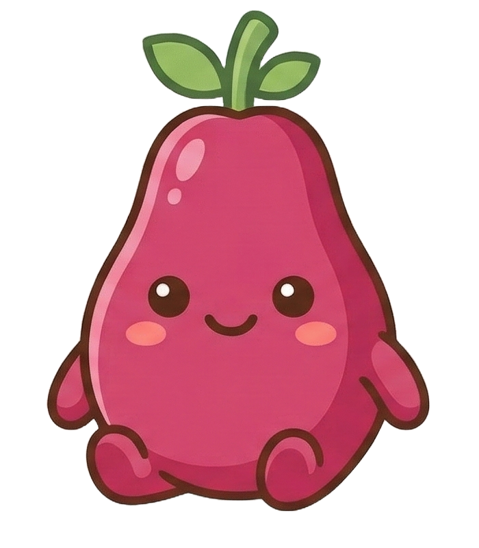

<p align="center">
  
</p>

<h1 align="center">papaya</h1>

<p align="center">
  ai-powered short-form video editor
</p>

---

papaya is a timeline-based video editor with an AI assistant that can generate video clips, images, music, captions, and apply edits — all from natural language. built for 9:16 portrait content.

## features

- **ai chat editor** — describe what you want and the ai applies timeline diffs (cuts, trims, moves, inserts)
- **video generation** — generate video clips from text prompts via google veo 3
- **image generation** — generate title cards and stills via google imagen
- **music generation** — generate soundtracks via google lyria
- **speech-to-text captions** — transcribe audio with groq whisper, word-level timing for karaoke-style highlighting
- **ffmpeg effects** — the ai can apply speed changes, reverse, color grading, and other ffmpeg filters directly
- **auto edit** — one-click: analyzes clips, makes smart cuts, adds soundtrack, title card, and captions
- **clip extend** — extend any clip with ai-generated continuation using veo
- **ai transitions** — generate transitions between clips using veo
- **export** — render to mp4 via diffusion studio encoder

## tech stack

| layer | tech |
|-------|------|
| frontend | react 19, typescript, vite, tailwind css 4, radix ui, zustand |
| backend | hono, bun |
| video engine | @diffusionstudio/core, ffmpeg |
| ai | gemini 3.1 pro (orchestrator), veo 3 (video), imagen (images), lyria (music), groq whisper (stt) |

## setup

```bash
# clone and install
git clone <repo-url> && cd papaya
bun install

# set env vars
cp .env.example .env
# add your keys:
#   GEMINI_API_KEY=...
#   GROQ_API_KEY=...

# run dev server (frontend :5173, backend :3111)
bun run dev
```

## env vars

| var | purpose |
|-----|---------|
| `GEMINI_API_KEY` | google ai — video/image/music generation + orchestrator |
| `GROQ_API_KEY` | groq — whisper speech-to-text for captions |

## project structure

```
server/
  index.ts              # hono app entry
  routes/               # api routes (project, assets, ai, timeline, export, generate)
  services/
    ai-orchestrator.ts  # gemini tool-use loop
    ai-tools.ts         # tool declarations + execution
    veo.ts              # veo video generation
    imagen.ts           # imagen image generation
    lyria.ts            # lyria music generation
    groq-stt.ts         # groq whisper stt
    ffmpeg.ts           # ffmpeg wrappers
    project-store.ts    # in-memory project state

shared/
  types.ts              # shared types (project, track, clip, caption, diff)
  diff-ops.ts           # timeline diff operations

src/
  components/
    bins/               # media bin / asset browser
    chat/               # ai chat panel
    preview/            # video player, transport bar, export dialog
    timeline/           # multi-track timeline
    layout/             # app shell, toasts
  hooks/                # playback, keyboard shortcuts, project loading
  stores/               # zustand stores (project, chat, playback)
  lib/                  # composition manager (diffusion studio bridge)
```
